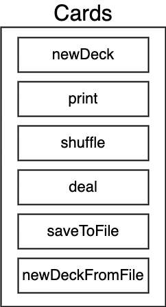

# Go

### The fundamentals and advanced features of the Go Programming Language.

---

<b>helloworld</b> - Boring Ol' Hello World.

<b>cards</b> - A package that simulates playing around with a deck of playing cards.

- Creates a list of playing cards.
- Logs out the contents of a deck of cards.
- Shuffles all the cards in a deck.
- Creates a 'hand' of cards.
- Saves a list of cards to a file on the local machine.
- Loads a list of cards from the local machine.
    
  
